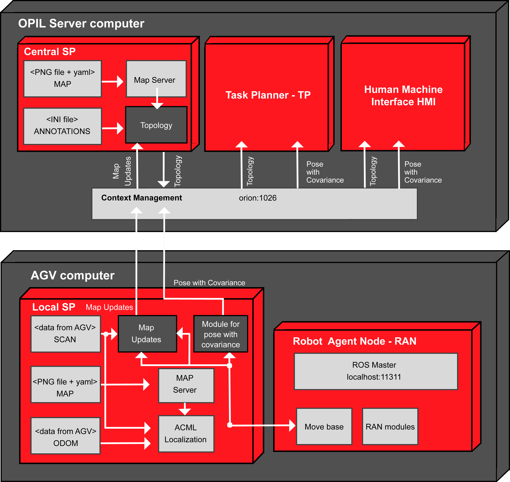
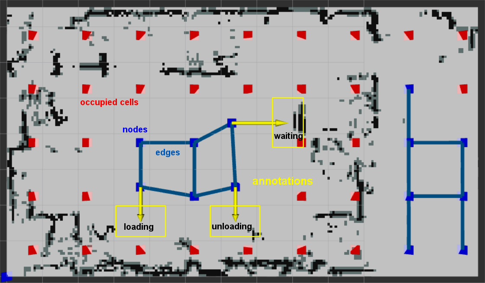
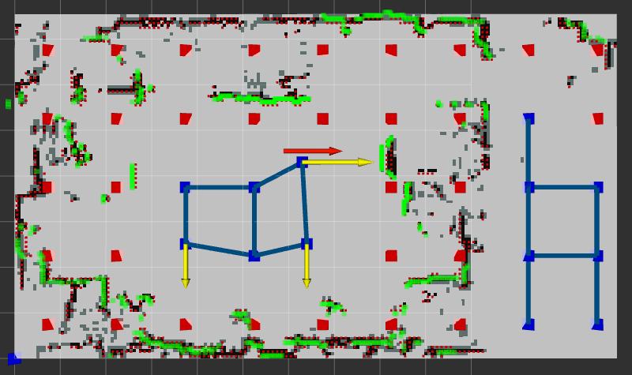
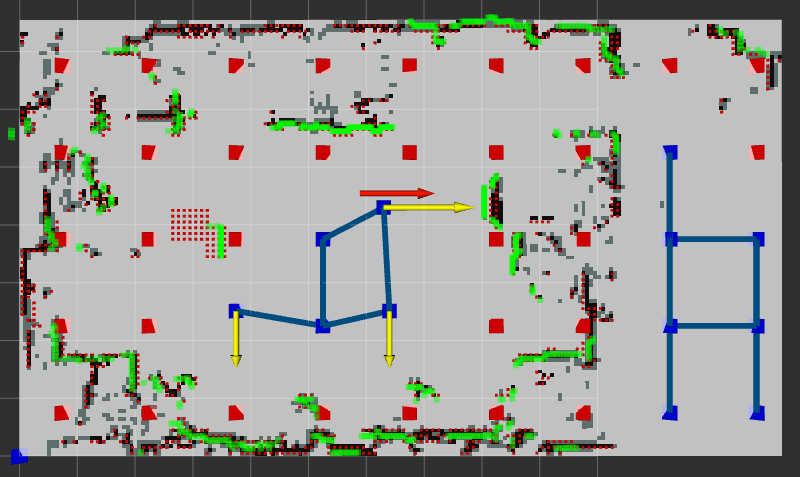
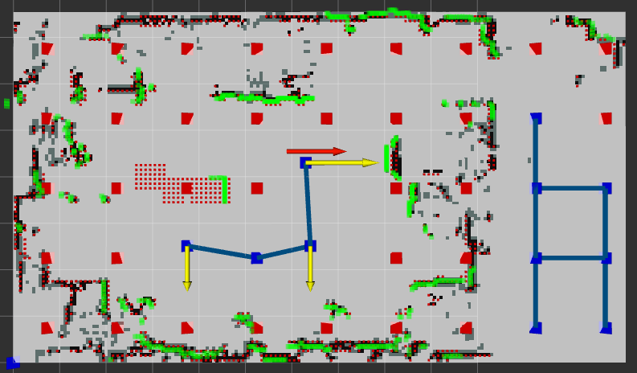

# Introduction Central Sensing & Perception (Central SP)

For full documentation visit L4MS <https://l4ms.org>.

<!--Link to other modules of OPIL (opil-MODULENAME.l4ms.eu):-->

<!--* [Robot Agent Node (RAN)](http://opil-ran.l4ms.eu)-->
<!--* [Human Agent Node (HAN)](http://opil-han.l4ms.eu)-->
<!--* [Sensor Agent Node (SAN)](http://opil-san.l4ms.eu) -->
<!--* [Task Planner (TP)](http://opil-tp.l4ms.eu)-->
<!--* [Human Machine Interface (HMI)](http://opil-hmi.l4ms.eu)-->
<!--* [Context Management (CM)](http://opil-cm.l4ms.eu) -->

## Overview Central SP

SP (Sensing & Perception) is a software module as part of OPIL (Open Platform for Innovation in Logistics). 
It provides the pose of the AGV inside the built map of the environment in which the AGV is navigating and updates the map with the new sensor readings.
Additionally, it can build the map with SLAM (Simultaneous Localization And Mapping) if no map is given initially. It uses the range data (laser, kinect) for map building and updating the map, and odometry sensors (encoders, IMU) with range data and map for localization inside the map.

## Structure of SP

There are two instances of SP module: 

* The Central SP as the OPIL Server Node
* The Local SP as the OPIL IoT Node

Every AGV has it's own Local SP, that takes care of localization and mapping. It localizes the AGV inside the map, and it creates a local map of AGV's surrounding.
Every AGV sends this local map data as an update to a Central SP, which is on the OPIL server. The Local SP is connected to Robot Agent Node (RAN) through ROS Master at RAN side so that navigation inside RAN can get the pose data at high rate.  
The Central SP creates a topology map of the factory floorplan for the Task Planner (TP) and Human Machine Interface (HMI) using the local updates from AGVs and an initial map.
The following figure explains the architecture of the SP modules with the given initial map of the factory (either after a SLAM process or extracted from a CAD drawing). Orange boxes are modules developed for SP, while blue ones are the standard ROS modules. Required inputs are map file with its parameter (PNG file), file with annotations (loading, unloading areas, etc.), laser data (SCAN) and odometry data (ODOM).

The functionalities of the Central SP module are listed as follows:

## Mapping - the Central SP

* Uses a map from CAD or as result of SLAM for localization
* Creates a topology for Task Planner from the map and annotations file
* Merges local map updates from the Local SP into a global map (gridmap) and updates the topology

## <a name="topologyupdates">Illustration of topology and map updates</a>

An example of SP module functionalities in a built map used in the demo in Zagreb at the review meeting is shown in the following figures. 

### Annotations and topology
This figure shows the topology creation with the annotations marked with yellow arrows (the loading, unloading and waiting areas).
Blue squares are nodes of the topology graph, while lines connecting them are edges of the topology graph. Red squares are the gird cells which contain obstacle within the square of specified size (1.5 m in this example).
From the annotation file containing the annotation coordinates, distance and theta, it is calculated where the AGV needs to be placed in front of the annotation according to the distance from the annotation and the orientation theta. It changes the values of the computed nodes from gridmap cells so that Task Planner can use these nodes as goals.

### <a name="mapupdates1">Map updates 1</a>
The next figure shows the map updates and the localization within the known map. Green dots are the laser readings sensed from the calculated pose (x,y,theta) marked with red arrow.
Tiny red squares (0.1 m) are the local map built with the laser readings. 

### Map updates 2 - change of topology
To illustrate how local map updates influence on the topology, a box was moving in front of the robot. There are more data in the local map updates (tiny red squares) which are used in the Central SP for topology update. Here, it can be seen that one node became occupied and is removed from the topology graph. The edges that are connected to this node are also removed from the topology graph.

### Map updates 3 - change of topology
In this last figure, the new local updates changed the topology even more and one more node and corresponding edges were removed from the topology graph.

# Next steps

Follow the [Install instructions](./opil_server_sp_install.md).   
For more details how everything works check the [API.](./../../develop/SP/opil_api_sp.md)     
        
