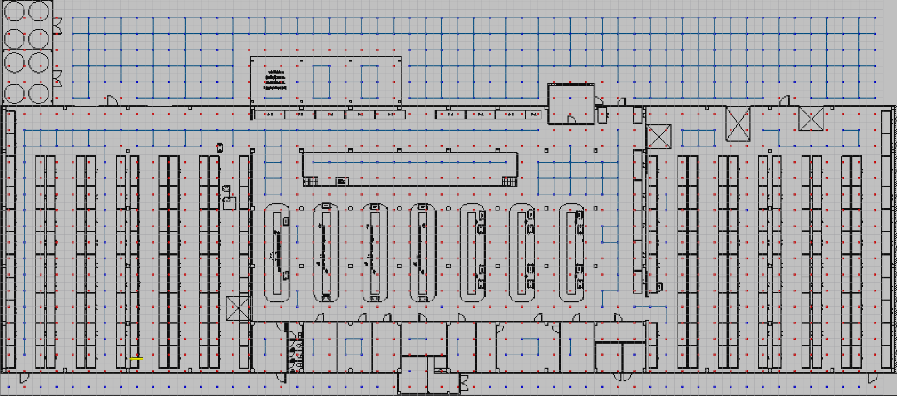
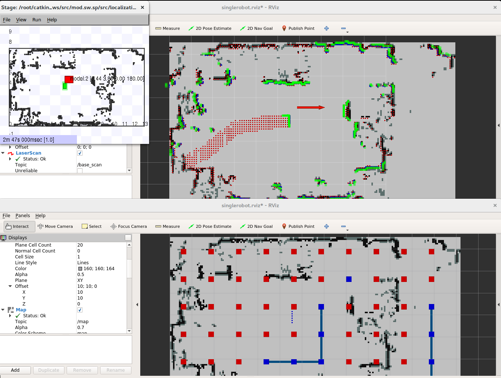

# Start Guide

Before starting the Central SP module follow the [Install guide](./opil_server_sp_install.md).


In the following, two start options will be described, depending if you installed the source from the docker containers or from scratch.


## <a name="fromdocker">Starting from Docker - Central SP</a>

Go to the folder where you put your [docker-compose.yml](./opil_server_sp_install.md#dockercompose) file and type:
```
xhost local:root
sudo docker-compose up
```
You should see the entities in, e.g. firefox, at the address <http://localhost:1026/v2/entities>. There should be a topic `/map/graph`.

This docker container starts the creation of a topology graph from the given map file and with included annotations from the annotation file. As a default, IML lab will be started with 4 annotations, as is the case in this example, where blue squares are the vertices of the graph placed regularly in the grid except if annotations change the position of the vertices (yellow arrow), and blue line segments are the edges of the graph. Red squares are possible vertex positions which are occupied.

 

To zoom the rviz window use mouse scroll, to translate the view press shift key and mouse button at the same time.


To use arbitrary annotations file and map file you should create `annotations.ini`, `testmap.yaml`, and `testmap.png` files and put it in the same folder next to the docker-compose.yml and uncomment the lines containing these files in [docker-compose.yml](./opil_server_sp_install.md#dockercompose) under the **volumes**. 
<!--These example files can be found in the folder `test/docker_compose_files/Central_SP_docker`. -->

**Annotations** are written in the vertex such that coordinates of the vertex is changed from the cell center to the coordinates defined by the annotation that belongs to that cell, and it's **name** is changed to the label of the annotation. The following example explains the creation of annotations in the topology graph. First, create the following file and save it under the name `annotations.ini`:
```
#annotations.ini
[P1]
# coordinates
point_x = 18.4
point_y = 6.5
theta = 180
distance = 1.8
```
where **P1** is the annotation label, **point_x**, **point_y** are coordinates of the annotation, and **theta** and **distance** determine where the topology vertex should be so that Task Planner can use this coordinates as the goal distanced for a defined **distance** (1.8 m in this example) from the annotation and oriented towards the annotation so that AGV has heading **theta** (180 degrees in this example) with respect to the positive x-axis. To use the created `annotations.ini` instead the default one inside the docker, uncomment the line (remove #) in [docker-compose.yml](./opil_server_sp_install.md#dockercompose) under the **volumes**:
```
            - ./annotations.ini:/root/catkin_ws/src/maptogridmap/launch/annotations.ini:ro
```

After restarting docker-compose.yml, i.e., type:
```
sudo docker-compose up
```
the result should be as in this figure:


<a name="prepmap">The map</a>
can be changed by putting two files as **volumes** in [docker-compose.yml](./opil_server_sp_install.md#dockercompose): `testmap.yaml` and `testmap.png`. The second file can be any bitmap picture (pgm), grayscale is desired, but if not, it will be automatically converted to a grayscaled image. 
Here is an example of the CHEMI factory floorplan saved as png file:


`testmap.yaml` is a parameter file with **resolution** and gray thresholds for defining what is free and what is occupied, as in this example yaml file:
```
#testmap.yaml
image: map.png
resolution: 0.06
origin: [0.0, 0.0, 0.0]
negate: 0
occupied_thresh: 0.65
free_thresh: 0.196
```
where the image name is `map.png` to which your `testmap.png` is copied to on the docker side, **resolution** defines the size of the pixel of the png file in meters. To calculate the resolution, you need to know the width of the image in meters. Then, simply divide the width of the image with the number of pixels. Adjust the parameters **occupied_thresh** and **free_thresh** to different values, depending on which shade of grey should be considered as occupied and free, respectively. 
To use the created `testmap.png` and `testmap.yaml` uncomment the lines in the [docker-compose.yml](./opil_server_sp_install.md#dockercompose):
```
            - ./testmap.yaml:/root/catkin_ws/src/maptogridmap/launch/map.yaml:ro
            - ./testmap.png:/root/catkin_ws/src/maptogridmap/launch/map.png:ro
```
After restarting docker-compose.yml this is what should be the result:



It can be seen that here the topology nodes are too rare and we are missing some of them in narrow passages. In the following we will change the size of the grid cell so that we do not miss topology nodes in the passages between the racks (however, this will be solved differently in OPIL v3). In this example map the passage is 2.5 m wide, which means the size of the cell size should be half of it to include the worst case of the alignment of passages with the grid.
To change the size of the grid cell for calculating the topology, use this example `topology.launch` file:

### <a name="topologylaunch">topology.launch</a>
```
<launch>
<node name="map_server" pkg="map_server" type="map_server" args="$(find maptogridmap)/launch/map.yaml" respawn="false" >
<param name="frame_id" value="/map" />
</node>
<node name="rviz" pkg="rviz" type="rviz" args="-d $(find maptogridmap)/singlerobot.rviz" /> 
<node name="map2gm" pkg="maptogridmap" type="map2gm" output="screen">
        <param name="cell_size" type="double" value="2.0" />
        <param name="annotation_file" textfile="$(find maptogridmap)/launch/annotations.ini" />
</node>
    <!-- Run FIROS -->
    <node name="firos" pkg="firos" type="core.py" />
</launch>
```
and change the **cell_size** to something else than 2.0 m. 
To use the created topology.launch uncomment the line in [docker-compose.yml](./opil_server_sp_install.md#dockercompose):
```
            - ./topology.launch:/root/catkin_ws/src/maptogridmap/launch/topology.launch:ro
```


This is the result for changing the parameter **cell_size** to 1.25 m:


There are also some prepared maps inside this docker which can be set by changing the `topology.launch` file. Replace the lines from 2-4 in [topology.launch](#topologylaunch) with the following lines:

* CHEMI map
```
    <node name="map_server" pkg="map_server" type="map_server" args="$(find lam_simulator)/yaml/CHEMIchangedres.yaml" respawn="false"> 
       <param name="frame_id" value="/map" /> 
    </node>	    	  
```
* ICENT map
```
<node name="map_server" pkg="map_server" type="map_server" args="$(find lam_simulator)/yaml/Andamapa.yaml" respawn="false" >
<param name="frame_id" value="/map" />
</node>
```
* IML map
```
<node name="map_server" pkg="map_server" type="map_server" args="$(find lam_simulator)/yaml/IMLlab.yaml" respawn="false" >
<param name="frame_id" value="/map" />
</node>
```
* MURAPLAST map
```
<node name="map_server" pkg="map_server" type="map_server" args="$(find lam_simulator)/yaml/floorplan_muraplast.yaml" respawn="false" >
<param name="frame_id" value="/map" />
</node>
```


## How to start the Local and Central SP docker containers together

Prepare a following docker-compose.yml to start both Central and Local SP. You can also start them on different machines.
This example uses the Local SP that contains the Stage simulator. 

```
version: "3"
services:      
    #Context Broker
    orion:        
        image: fiware/orion
        ports:
            - 1026:1026
        command: 
            -dbhost mongo
    mongo:
        restart: always
        image: mongo:3.4
        command: --nojournal    
#S&P
    sp:
        restart: always
        image: l4ms/opil.sw.sp.central:latest
        volumes:
            #- path on the host : path inside the container
            - /tmp/.X11-unix:/tmp/.X11-unix:rw
        environment:
            - FIWAREHOST=orion
            - HOST=sp
            - NETINTERFACE=eth0
            - DISPLAY=$DISPLAY
    splocal:
        restart: always
        image: l4ms/opil.iot.sp.local:latest
        volumes:
            #- path on the host : path inside the container
            - /tmp/.X11-unix:/tmp/.X11-unix:rw
        environment:
            - FIWAREHOST=orion
            - HOST=splocal
            - NETINTERFACE=eth0
            - DISPLAY=$DISPLAY
            - SIMULATION=true
```

This will start everything with the IML lab. The following figure presents the output after moving the green box in the Stage simulator:


One rviz window is from the Local SP, where you can see the AGV's pose (red arrow) and local updates (red tiny squares). Another rviz window is from the Central SP, where you can see the updates of the topology and new obstacles presented with blue tiny squares showing only the current position of the new obstacle. All new obstacles are processed as they are received so only new ones are sent. That is the reason why in the Local SP you can see a trail of the obstacle, while in the Central SP there is no trail but the topology is permanently changed.


Here is the examle of using the ICENT map (changed [topology.launch](#topologylaunch) and [local_robot_sim.launch](opil_local_sp_gettingStarted.md#localrobotsimlaunch)). 
After moving the green box in the simulator the result can be obtained as in this figure:



## <a name="fromscratch">Starting from Scratch</a>

In this quick guide, everything will be started on the same computer where you installed ROS and this source code. For advanced configuration of starting at different computers check [Interfaces](./../../develop/SP/opil_sp_interfaces.md).

* Start the map by launching the map_server package:
```
terminal 1: roslaunch maptogridmap startmapserver.launch
```


You can also prepare your own simulation following [the guide for preparing the map.](./../../develop/SP/opil_api_local_sp.md#preparingmap)

* Start the topology calculation:
```
terminal 2: roslaunch maptogridmap startmaptogridmap.launch
```
You can check the created topology in the topic graph by typing: 
```
rostopic echo /map/graph
```

You can change the resolution of the global gridmap and topology (the distance between the nodes) by checking the Section [Topology](./../../develop/SP/opil_api_sp.md#topology). There you can also find about annotations and how to change theirs parameters. 


To test if entities are sent to OCB, prepare the following docker-compose.yml on the machine where you want to have the OPIL server:
```
version: "3"
services:      
    #Context Broker
    orion:        
        image: fiware/orion
        ports:
            - 1026:1026
        command: 
            -dbhost mongo
            
    mongo:
        restart: always
        image: mongo:3.4
        command: --nojournal
```

To test sending topology to OCB put in firos/config all json files from test/config_files/machine_1. Set the right IP addresses for your machine (server), OPIL server (contextbroker), and interface (check with ifconfig) in firos/config/config.json. Run firos in a new terminal and check entities in a web browser at the address <http://OPIL_SERVER_IP:1026/v2/entities.
```
terminal 5: rosrun firos core.py 
```

You can also start a single launch file which starts map_server, topology creation, and firos (this file is used in a docker container of Central SP):
```
roslaunch maptogridmap topology.launch
``` 
For more details how to set up firos config files check the Section [Interfaces](./../../develop/SP/opil_sp_interfaces.md). For more examples on sending and receiving these topics through OCB check the Section [Examples](./../../develop/SP/opil_api_sp.md#examplesOCB).
