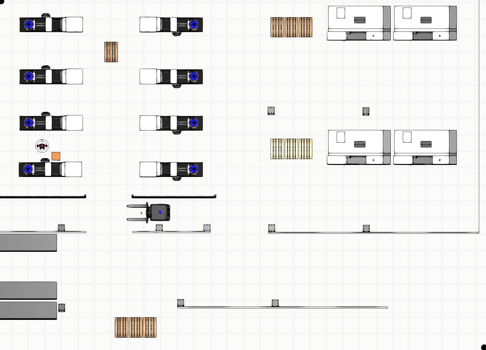
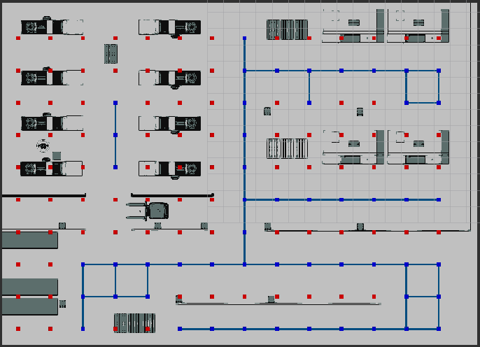
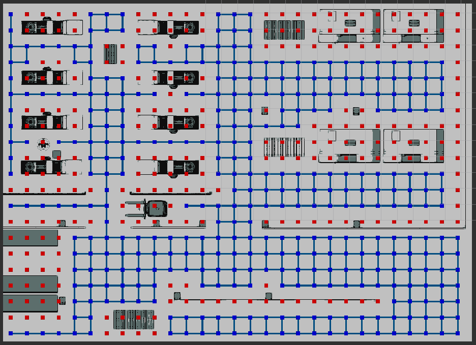
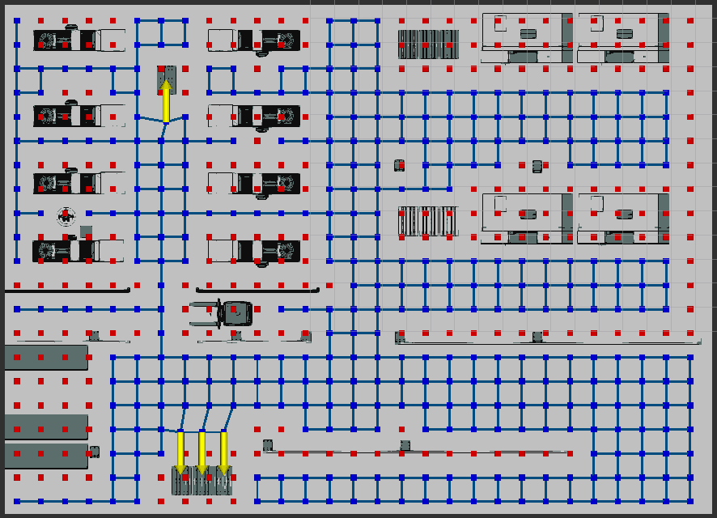

# Central SP Installation

There are two ways of installing the SP module. You can use the docker containers or compile it from the source.


## Install from Docker Container

There are two docker containers - the Central SP and the Local SP.
The Central SP is located at 
<https://hub.docker.com/r/l4ms/opil.sw.sp.central>

### The Central SP docker 


To install it you need to prepare a docker-compose.yml following this example:
### <a name="dockercompose">docker-compose.yml</a>

```
version: "3"
services:      
    #Context Broker
    orion:        
        image: fiware/orion
        ports:
            - 1026:1026
        command: 
            -dbhost mongo
    mongo:
        restart: always
        image: mongo:3.4
        command: --nojournal    
#S&P
    sp:
        restart: always
        image: l4ms/opil.sw.sp.central:latest
        volumes:
            #- path on the host : path inside the container
            - /tmp/.X11-unix:/tmp/.X11-unix:rw
        volumes:
            #- path on the host : path inside the container
            - /tmp/.X11-unix:/tmp/.X11-unix:rw
            - ./annotations.ini:/annotations.ini:ro
            - ./floorplan.yaml:/map.yaml:ro
            - ./floorplan.png:/map.png:ro
            - ./topology.launch:/topology.launch:ro
        environment:
            - FIWAREHOST=orion
            - HOST=sp
            - NETINTERFACE=eth0
            - DISPLAY=$DISPLAY
```
This example uses the version 3 and it does not need links to enable services to communicate. It is assumed that for testing all services will be on the same machine (localhost). If orion is started on another machine, then environment variable of sp needs to have changed FIWAREHOST to IP address of that machine. To update the docker-compose to the working version for the version 3 (1.22) type: (NOTE: you should remove prior versions of docker-compose)
```
sudo curl -L https://github.com/docker/compose/releases/download/1.22.0/docker-compose-`uname -s`-`uname -m` -o /usr/local/bin/docker-compose
```
and then
```
chmod +x /usr/local/bin/docker-compose
```
To check the version type:
```
sudo docker-compose --version
```
You should see:
```
docker-compose version 1.22.0, build f46880fe
```

First, set up the display for viewing the rviz visualization and Stage:
```
xhost local:root
```
This needs to be called only once.
Then, start it from the folder where you put your docker-compose.yml file:
```
sudo docker-compose up
```
To check if everything is working properly follow the guide [Starting from Docker - Central SP.](./opil_server_sp_gettingStarted#fromdocker)


## Install from Scratch 

To install Firos v2:

```git clone --recursive https://github.com/iml130/firos.git```


Install ROS packages:

```sudo apt-get install ros-kinetic-navigation```

```sudo apt-get install ros-kinetic-gmapping```

```sudo apt-get install ros-kinetic-teleop-twist-keyboard```

Install from SourceCode:

* put all ROS packages of Sensing and Perception to your src folder of your catkin workspace or create a new one by typing catkin_init_workspace in src folder. Then compile it with catkin_make in one folder up.
```
cd ..
catkin_make
```
To check if everything is working properly follow the guide [Starting from Scratch.](./opil_server_sp_gettingStarted.md#fromscratch)

# SP Server Start Guide

Before starting the Central SP module follow the [Install guide](./opil_server_sp_install.md).


In the following, two start options will be described, depending if you installed the source from the docker containers or from scratch.


## <a name="fromdocker">Starting from Docker - Central SP</a>

Go to the folder where you put your [docker-compose.yml](./opil_server_sp_install.md#dockercompose) file and type:
```
xhost local:root
sudo docker-compose up
```

This docker container starts the creation of a topology graph from the given map file and with included annotations from the annotation file. As a default, no map is loaded and the following message will appear in terminal:
```
sp_1     | please insert a floorplan.png and floorplan.yaml file to begin!
sp_1     | in your docker-compose.yml put under volumes:
sp_1     |             - ./floorplan.yaml:/map.yaml:ro
sp_1     |             - ./floorplan.png:/map.png:ro
opilserver_sp_1 exited with code 0
```

### <a name="prepmap">Setting the map</a>

Two files need to be prepared and put under **volumes** in [docker-compose.yml](./opil_server_sp_install.md#dockercompose): 

*	`floorplan.yaml`
*	`floorplan.png` 

Right now in this docker container only PNG file is supported. Export your floorplan layout to PNG. 
Here is an example of `floorplan.png`:



Then, you need to set up parameters for transforming the PNG file into a map with the origin and dimensions in meters. This needs to be prepared in the `floorplan.yaml`. Here is an example:
```
#floorplan.yaml
image: map.png
resolution: 0.0196
origin: [-12.7095, -7.5866, 0.0]
negate: 0
occupied_thresh: 0.65
free_thresh: 0.196
```
where

* the image name is `map.png` by which your `floorplan.png` is overwritten on the docker side
* **resolution** defines the size of the pixel of the png file in meters. To calculate the resolution, you need to know the width of the image in meters. Then, simply divide the width in meters with the width in the number of pixels. 
* **negate** can inverse the free-occupied values if set to 1
* **occupied_thresh** and **free_thresh** define the thresholds that tell which brightness level should be considered as occupied and free, respectively. 
* **origin** is the (x,y,z) vector in meters describing the lower-left corner. With (0,0,0) the origin will be in the lower-left corner.

The files `floorplan.yaml` and `floorplan.png` need to be in the folder where you put your docker-compose.yml.
After restarting docker-compose.yml, i.e.,
```
sudo docker-compose up
```
 this is what should be the result:



You should see the entities in, e.g. firefox, at the address <http://localhost:1026/v2/entities>. There should be a topic `/map/graph`.
In this example, blue squares are the vertices of the graph placed regularly in the grid (distanced 2 meters), and blue line segments are the edges of the graph. Red squares are possible vertex positions which are occupied.
To zoom the rviz window use mouse scroll, to translate the view press shift key and mouse button at the same time.


### Setting the topology cell_size

It can be seen that here the topology nodes are too rare and we are missing some of them in narrow passages. In the following we will change the size of the grid cell so that we do not miss topology nodes in the passages between the racks (however, this will be solved differently in OPIL v3). In this example map the passage is 2.5 m wide, which means the size of the cell size should be half of it to include the worst case of the alignment of passages with the grid.
To change the size of the grid cell for calculating the topology, prepare the `topology.launch` file:

### <a name="topologylaunch">topology.launch</a>
```
<launch>
<node name="map_server" pkg="map_server" type="map_server" args="$(find maptogridmap)/launch/map.yaml" respawn="false" >
<param name="frame_id" value="/map" />
</node>
<node name="rviz" pkg="rviz" type="rviz" args="-d $(find maptogridmap)/singlerobot.rviz" /> 
<node name="map2gm" pkg="maptogridmap" type="map2gm" output="screen">
        <param name="cell_size" type="double" value="1.0" />
        <param name="annotation_file" textfile="$(find maptogridmap)/launch/annotations.ini" />
</node>
    <!-- Run FIROS -->
    <node name="firos" pkg="firos" type="core.py" />
</launch>
```
where the **cell_size** is set to 1.0 m. 
To use the created topology.launch put it next to the docker-compose.yml file and restart docker-compose.yml.
This is the result for changing the parameter **cell_size** to 1.0 m:



### Setting the annotations

To use arbitrary annotations you should create `annotations.ini` file and put it in the same folder next to the docker-compose.yml:

```
#annotations.ini
[W1]
# coordinates
point_x = -5.4
point_y = -6.0
theta = 270
distance = 1.8

[W2]
# coordinates
point_x = -4.5
point_y = -6.0
theta = 270
distance = 1.8

[W3]
# coordinates
point_x = -3.6
point_y = -6.0
theta = 270
distance = 1.8

[MoldingPallet]
# coordinates
point_x = -6.0
point_y = 10.5
theta = 90
distance = 1.8
```
where

* **W1**, **W2**, **W3**, **MoldingPallet** are the annotation labels
* **point_x**, **point_y** are coordinates of the annotation
* **theta** and **distance** determine where the topology vertex should be so that Task Planner can use this coordinates as the goal distanced for a defined **distance** from the annotation and oriented towards the annotation so that AGV has heading **theta** with respect to the positive x-axis. 

Coordinates of the annotations can be chosen arbitrary. They can be set as the middle of the pallet or the corner of the pallet, for example. The most important is to calculate the right position where an AGV will be placed in front of the annotation by setting the right distance, and orientation from the annotation coordinates.

After restarting docker-compose.yml,
the result should be as in this figure:



Four annotations are in this example, which change the coordinates of vertices where the AGV needs to be located to perform some operation, e.g., loading/unloading.


## How to start the Local and Central SP docker containers together

Prepare a following docker-compose.yml to start both Central and Local SP. This example uses the same machine for Local and Central SP, but you can also start them on different machines.
This example uses the Local SP that contains the Stage simulator. Check how to prepare the Local SP [here](./opil_local_sp_gettingStarted.md)

```
version: "3"
services:      
    #Context Broker
    orion:        
        image: fiware/orion
        ports:
            - 1026:1026
        command: 
            -dbhost mongo
    mongo:
        restart: always
        image: mongo:3.4
        command: --nojournal    
#S&P
    sp:
        restart: always
        image: l4ms/opil.sw.sp.central:latest
        volumes:
            #- path on the host : path inside the container
            - /tmp/.X11-unix:/tmp/.X11-unix:rw
            - /tmp/.X11-unix:/tmp/.X11-unix:rw
            - ./annotations.ini:/annotations.ini:ro
            - ./floorplan.yaml:/map.yaml:ro
            - ./floorplan.png:/map.png:ro
            - ./topology.launch:/topology.launch:ro
        environment:
            - FIWAREHOST=orion
            - HOST=sp
            - NETINTERFACE=eth0
            - DISPLAY=$DISPLAY
    splocal:
        restart: always
        image: l4ms/opil.iot.sp.local:latest
        volumes:
            #- path on the host : path inside the container
            - /tmp/.X11-unix:/tmp/.X11-unix:rw
            - ./floorplan.yaml:/map.yaml:ro
            - ./floorplan.png:/map.png:ro
            - ./amcl.launch:/amcl_map.launch:ro
            - ./floorplan.world:/map.world:ro
            - ./local_robot_sim.launch:/local_robot_sim.launch:ro
        environment:
            - FIWAREHOST=orion
            - HOST=splocal
            - NETINTERFACE=eth0
            - DISPLAY=$DISPLAY
            - SIMULATION=true
```

The following figure presents the output after moving the green box in the Stage simulator:


One rviz window is from the Local SP, where you can see the AGV's pose (red arrow) and the local updates (red tiny squares). Another rviz window is from the Central SP, where you can see the updates of the topology and new obstacles presented with blue tiny squares showing only the current position of the new obstacle. Vertices at the position of a new obstacles are removed from the topology (blue squares become red, and connections are removed). All new obstacles are processed as they are received so only new ones are sent. That is the reason why in the Local SP you can see a trail of the obstacle, while in the Central SP there is no trail but the topology is permanently changed.


## <a name="fromscratch">Starting from Scratch</a>

In this quick guide, everything will be started on the same computer where you installed ROS and this source code. For advanced configuration of starting at different computers check [Interfaces](./../../develop/SP/opil_sp_interfaces.md).

* Start the map by launching the map_server package:
```
terminal 1: roslaunch maptogridmap startmapserver.launch
```


You can also prepare your own simulation following [the guide for preparing the map.](./../../develop/SP/opil_api_local_sp.md#preparingmap)

* Start the topology calculation:
```
terminal 2: roslaunch maptogridmap startmaptogridmap.launch
```
The result should be the started rviz with the map and topology with annotations as presented here:

You can check the created topology in the topic graph by typing: 
```
rostopic echo /map/graph
```

You can change the resolution of the global gridmap and topology (the distance between the nodes) by checking the Section [Topology](./../../develop/SP/opil_api_sp.md#topology). There you can also find about annotations and how to change theirs parameters. 


To test if entities are sent to OCB, prepare the following docker-compose.yml on the machine where you want to have the OPIL server:
```
version: "3"
services:      
    #Context Broker
    orion:        
        image: fiware/orion
        ports:
            - 1026:1026
        command: 
            -dbhost mongo
            
    mongo:
        restart: always
        image: mongo:3.4
        command: --nojournal
```

To test sending topology to OCB put in firos/config all json files from test/config_files/machine_1. Set the right IP addresses for your machine (server), OPIL server (contextbroker), and interface (check with ifconfig) in firos/config/config.json. Run firos in a new terminal and check entities in a web browser at the address <http://OPIL_SERVER_IP:1026/v2/entities>.
```
terminal 5: rosrun firos core.py 
```

You can also start a single launch file which starts map_server, topology creation, and firos (this file is used in a docker container of Central SP):
```
roslaunch maptogridmap topology.launch
``` 
For more details how to set up firos config files check the Section [Interfaces](./../../develop/SP/opil_sp_interfaces.md). For more examples on sending and receiving these topics through OCB check the Section [Examples](./../../develop/SP/opil_api_sp.md#examplesOCB).

# Deinstallation
There is currently no deinstallation how-to. Simply remove all unused docker images and remove the source code.

# Upgrades
This is the first appearance of SP module so there is no upgrade procedure.

# Deprecated Features
There are no deprecated features. 


