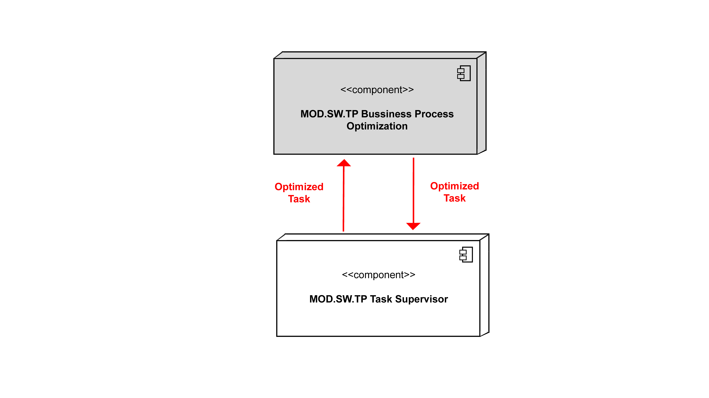
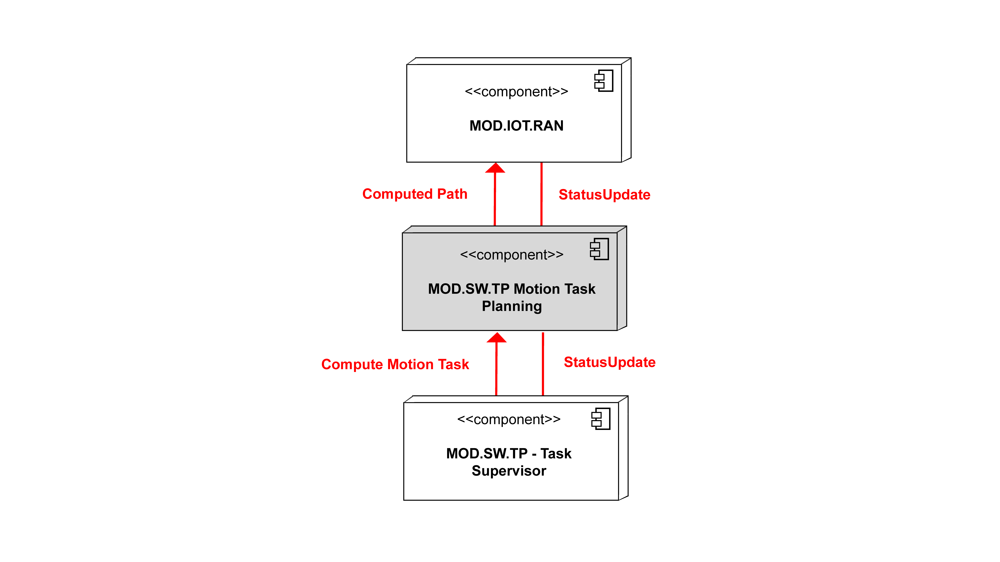
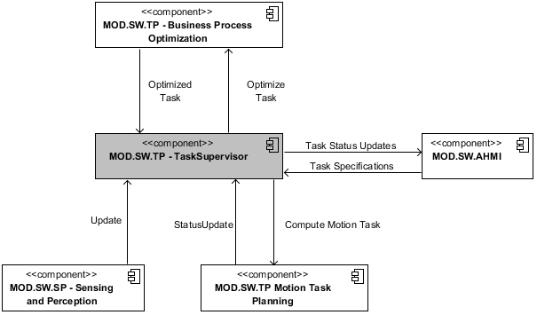

# Introduction Task Planner (TP)

The "Software system" layer represents the highest level of OPIL where all the services that this platform provides to the end users are logically grouped by design. This level is made of three main modules. Task Planner is one of the three OPIL Components and Functional blocks which this 3rd Layer is made of. Regarding the OPIL architecture, this node consists of three different sub-modules. Firstly, the Business Process Optimization functional block decides and optimizes the tasks to be dispatched to the different agents. Secondly, the Motion Task Planning plans the motion tasks for the robot agents. Lastly, the Task Supervisor monitors the execution of the task dispatched to the agents. Task Planner makes it possible for the different components to communicate with each other and be composed into full-fledged logistic system in a manufacturing environment.

# Description
The three main functional building blocks like the Business Process Optimization (BPO), the Motion 
Task  Planning  (MTP)  and  the Task  Supervisor  (TS)  will  be  described in this section.
 
* ### Business Process Optimization
The Business Process Optimization (BPO) sub-module of the OPIL Task Planner handles the on-the-fly optimization of the task that is received from the Task Supervisor sub-module of the OPIL Task Planner. The BPO sub-module is responsible for minimizing the logistics resources that are required for a given task. The BPO receives a task specification from the Task Supervisor sub-module of the OPIL Task Planner in an appropriate formal language and parameterizes the task specification so that the resulting specification requires minimal (or near minimal) logistics resources for its fulfilment. The parameterized task specification is then transmitted back to the Task Supervisor sub-module of the OPIL Task Planner for determining the eventual Motion Task Plan that fulfils the specification. The Figure below depicts the interaction between the BPO sub-module with the Task Supervisor sub-module.

***

## Motion Task Planning
The Motion Task Planning (MTP) modules creates/computes a motion task plan for the involved agents. This motion task provides a deadlock-free, optimal or near optimal path without loops and collision. Beyond this path computation the Motion Task Planning component handles the communication with the agents. Paths for human agents will receive a higher priority than robotic agents. Already planned paths for robotic agents will be re-planned to avoid collision. In the case of system failures, the Motion Task Planning can re-plan on-the-fly a new motion task plan. The motion task plan will be dispatched to the agents, like AGVs or human agents. The figure below shows the usage of the Motion Task Planning component.

The MOD.SW.TP Motion Task Planning receives the start and end destinations of the appropriate Robot/ Human Agent Nodes. It computes the best, shortest and/or fastest path for the navigation and it handles the communication with the Robotic Agent Nodes (MOD.SW.RAN). Moreover, it is aware about the state, like current pose, current task, of the agents nodes.
***

## Task Supervisor
The Task Supervisor (TS) module receives task specification from the Advanced HMI Module in an appropriate formal language and parameterized task specification. These specified tasks, the currently available resources and some further boundary constraints will be the input for the Business Process Optimization. The Task Supervisor is also able to send the current state information to the Advanced HMI. Any changes inside the system will be handled through this sub-module. 

The figure above shows the usage of the MOD.SW.TP Task Supervisor component in the MOD.SW.TP module. The Task Supervisor receives information from the Sensing and Perception module and task specification from the Advanced HMI. Then, it sends task execution information status to the Advanced HMI, starts the Motion Task Planning process and the Business Process Optimization begins to minimize the logistic resources.
***
 

